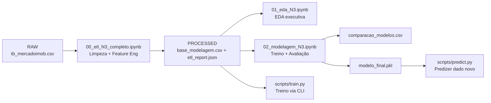

# N3 — Projeto Completo de Ciência de Dados (Mercado Imobiliário)

## Alunos
- **Alberto Zilio**
- **Roni Pereira**

> Disciplina: Ciência de Dados  
> Avaliação: **N3 — Trabalho Final (Projeto completo)**  
> Tipo de problema: **Regressão** (estimativa de `preco_m2`)

---

## Sumário
- [1) Problema de Negócio](#1-problema-de-negócio)
- [2) Estrutura do Repositório](#2-estrutura-do-repositório)
- [3) Pipeline (Arquitetura) e Dados](#3-pipeline-arquitetura-e-dados)
- [4) ETL (Parte 2) — Preparação e Qualidade](#4-etl-parte-2--preparação-e-qualidade)
- [5) EDA (Parte 2/3) — Entendimento do Dado](#5-eda-parte-23--entendimento-do-dado)
- [6) Modelagem e Avaliação (Parte 3) — Treino, Comparação e Seleção](#6-modelagem-e-avaliação-parte-3--treino-comparação-e-seleção)
- [7) Deploy (Parte 4) — Persistência do Modelo e Predição](#7-deploy-parte-4--persistência-do-modelo-e-predição)
- [8) Como executar](#8-como-executar)
- [9) Links RAW (GitHub) para Colab](#9-links-raw-github-para-colab)
- [10) Mapeamento do enunciado → evidências](#10-mapeamento-do-enunciado--evidências-no-repositório-prova-de-entrega)

---

## 1) Problema de Negócio

### 1.1 Contexto
A precificação de imóveis depende de múltiplos fatores (características físicas, comodidades, custos, localização, etc.). Ter uma estimativa consistente ajuda a apoiar decisões de corretores, proprietários e compradores, além de fornecer visibilidade sobre quais atributos mais influenciam o valor do imóvel.

### 1.2 Pergunta de negócio
**Quais características de um imóvel explicam melhor o preço por metro quadrado e como podemos estimá-lo automaticamente?**

### 1.3 Objetivo
Construir um modelo para estimar o **preço por metro quadrado (`preco_m2`)** a partir das features disponíveis no dataset (ex.: área, nº quartos, vagas, taxa condominial etc.).

**Tipo de problema:** Regressão.

---

## 2) Estrutura do Repositório

```text
N3_CIENCIA_DADOS/
├── data/
│   ├── dataset_original/
│   │   └── tb_mercadoimob.csv
│   └── dataset_processado_N3/
│       ├── base_modelagem.csv
│       ├── etl_report.json
│       ├── comparacao_modelos.csv
│       ├── metrics.json
│       ├── eda_correlacoes_top15.csv
│       └── figs_eda/
│           ├── hist_preco_m2.png
│           ├── box_preco_m2.png
│           └── top_corr_preco_m2.png
├── notebooks/
│   └── notebooks_N3/
│       ├── 00_etl_N3_completo.ipynb
│       ├── 01_eda_N3.ipynb
│       └── 02_modelagem_N3.ipynb
├── scripts/
│   ├── train.py
│   └── predict.py
├── modelo_final.pkl
├── requirements.txt
└── README.md
```

> Observação: a estrutura separa **RAW** (dado original) de **PROCESSED** (dado limpo e pronto para modelagem). Isso aumenta rastreabilidade e reprodutibilidade.

---

## 3) Pipeline (Arquitetura) e Dados

### 3.1 Visão geral (fluxo do projeto)


### 3.2 Separação RAW vs PROCESSED
- **RAW**: `data/dataset_original/tb_mercadoimob.csv` (dado original, sem alterações)
- **PROCESSED**: `data/dataset_processado_N3/base_modelagem.csv` e `data/dataset_processado_N3/etl_report.json`

**Por que isso importa?**
- Evita perda/alteração acidental dos dados originais
- Permite reproduzir exatamente o mesmo dataset de modelagem a partir do RAW
- Facilita auditoria (entender quais regras de limpeza e quais features foram usadas)

---

## 4) ETL (Parte 2) — Preparação e Qualidade

Notebook:
- `notebooks/notebooks_N3/00_etl_N3_completo.ipynb`

Entradas:
- `data/dataset_original/tb_mercadoimob.csv`

Saídas:
- `data/dataset_processado_N3/base_modelagem.csv`
- `data/dataset_processado_N3/etl_report.json`

### 4.1 Objetivo do ETL
Transformar os dados brutos (RAW) em uma base consistente e utilizável para treinamento de modelos:
- garantir consistência de tipos e unidades
- remover registros inválidos
- reduzir ruído (outliers extremos e erros)
- criar o target `preco_m2`
- gerar rastreabilidade (relatório do ETL)

### 4.2 Etapas executadas no ETL (explicação detalhada)
1. **Leitura do dataset original (RAW)**
   - Carrega o CSV original e padroniza nomes de colunas quando necessário.

2. **Tratamento de tipos e conversões**
   - Converte colunas numéricas que podem estar em texto (ex.: "R$ 1.000.000", "120 m²", "1.234,56") para `float`.
   - Usa coerção controlada para tratar erros e identificar valores inválidos.

3. **Remoção de registros impossíveis / inválidos**
   - Filtra linhas com `area <= 0` ou `valor <= 0`, pois inviabilizam o cálculo do target.
   - Remove registros com target indefinido ou não finito.

4. **Criação do target (`preco_m2`)**
   - `preco_m2 = valor / area`
   - Esse target padroniza imóveis de tamanhos diferentes e é adequado para comparação.

5. **Engenharia de atributos (features)**
   - Cria colunas binárias quando o dataset contém informações textuais (ex.: imóvel mobiliado, vista para o mar).
   - Padroniza categorias se existirem (ex.: tipo do imóvel).

6. **Tratamento de outliers**
   - Aplica estratégia estável (ex.: clipping por IQR/percentis) para reduzir influência de valores extremos em `preco_m2`,
     mantendo robustez do treino.

7. **Geração da base de modelagem**
   - Seleciona features relevantes e exporta `base_modelagem.csv`.

8. **Relatório do ETL (rastreabilidade)**
   - Gera `etl_report.json` com:
     - target definido
     - lista de features utilizadas
     - dimensões (linhas/colunas) antes e depois
     - observações resumidas

### 4.3 Resultado do ETL
- `base_modelagem.csv` contém as variáveis tratadas e o target pronto para treino.
- `etl_report.json` documenta o que foi considerado como target e features (ajudando a reprodutibilidade).

---

## 5) EDA (Parte 2/3) — Entendimento do Dado

Notebook:
- `notebooks/notebooks_N3/01_eda_N3.ipynb`

### 5.1 Objetivo da EDA
Garantir entendimento do dataset e justificar decisões de modelagem:
- verificar distribuição do target e presença de outliers
- medir quantidade de valores ausentes
- identificar variáveis mais associadas ao target
- comparar grupos (ex.: flags binárias) e inferir comportamento

### 5.2 O que foi analisado na EDA
1. **Visão inicial da base**
   - `shape`, amostra de registros, tipos e porcentagem de nulos.

2. **Distribuição do target (`preco_m2`)**
   - Histograma: mostra concentração e dispersão
   - Boxplot: evidencia possíveis outliers

3. **Associação numérica com o target**
   - Correlação (Pearson) entre features numéricas e target
   - Exporta top 15 para `eda_correlacoes_top15.csv`

4. **Comparações por variáveis binárias**
   - Se existirem `vista_mar_bin` e `mobiliado_bin`, compara médias/medianas de `preco_m2` por grupo.

5. **(Opcional) Categorias**
   - Se o dataset possuir colunas categóricas comuns (bairro, cidade, tipo), compara `preco_m2` agrupado.

### 5.3 Artefatos gerados pela EDA
- `data/dataset_processado_N3/eda_correlacoes_top15.csv`
- `data/dataset_processado_N3/figs_eda/`:
  - `hist_preco_m2.png`
  - `box_preco_m2.png`
  - `top_corr_preco_m2.png`

### 5.4 Conclusões típicas (resumo)
- A distribuição do target geralmente apresenta dispersão e possíveis outliers, justificando modelos robustos.
- Nem sempre relações são lineares, por isso modelos não lineares podem performar melhor.

---

## 6) Modelagem e Avaliação (Parte 3) — Treino, Comparação e Seleção

Notebook:
- `notebooks/notebooks_N3/02_modelagem_N3.ipynb`

### 6.1 Objetivo da modelagem
Treinar e comparar diferentes modelos a partir da base `base_modelagem.csv`, escolhendo o melhor por desempenho em teste.

### 6.2 Preparação para treino (explicação)
1. **Separação X e y**
   - `X`: features
   - `y`: target (`preco_m2`)

2. **Split treino/teste**
   - Divide a base em treino e teste (ex.: 80/20) para medir desempenho em dados não vistos.

3. **Pipeline de pré-processamento**
   - Numéricas:
     - imputação de nulos (mediana)
     - padronização (`StandardScaler`) para modelos lineares
   - Categóricas:
     - imputação (mais frequente)
     - `OneHotEncoder` para transformar categorias em variáveis dummies

**Por que usar Pipeline + ColumnTransformer?**
- Evita vazamento de dados (data leakage)
- Garante que o mesmo pré-processamento é aplicado no treino e no deploy
- Facilita salvar tudo junto no `modelo_final.pkl`

### 6.3 Modelos treinados (mínimo 3)
- `LinearRegression` (baseline)
- `Ridge(alpha=1.0)` (evita overfitting em dados lineares)
- `RandomForestRegressor(n_estimators=300)` (captura não linearidades e interações)

### 6.4 Métricas (mínimo 3) e interpretação
- **MAE**: média dos erros absolutos (interpretação direta)
- **RMSE**: penaliza mais erros grandes (útil quando outliers importam)
- **R²**: indicador de explicação da variância do target (quanto mais próximo de 1, melhor)

### 6.5 Resultados e seleção do melhor
Arquivo com resultados:
- `data/dataset_processado_N3/comparacao_modelos.csv`

Resumo (teste):
| Modelo | MAE | RMSE | R² |
|---|---:|---:|---:|
| RandomForest(n=300) | 875.4514 | 1783.5603 | 0.8339 |
| Ridge(alpha=1.0) | 2866.2643 | 3704.4110 | 0.2835 |
| LinearRegression | 2865.9531 | 3704.5434 | 0.2834 |

**Melhor modelo:** `RandomForest(n=300)` (menor RMSE e maior R²).

---

## 7) Deploy (Parte 4) — Persistência do Modelo e Predição

### 7.1 Objetivo do deploy na N3
Demonstrar que o modelo pode ser:
- **salvo** (persistência do pipeline completo)
- **carregado**
- **utilizado para prever um dado novo** (inferência)

### 7.2 Artefato do modelo
- `modelo_final.pkl`

Esse arquivo contém:
- pré-processamento (imputação, encoding e scaling)
- e o modelo final treinado

### 7.3 Deploy via notebook
No final do `02_modelagem_N3.ipynb`:
- o modelo é carregado (`joblib.load`)
- é feita previsão em um exemplo (`predict`)

### 7.4 Deploy via scripts (recomendado)
Arquivos:
- `scripts/train.py`
  - treina, compara e salva:
    - `data/dataset_processado_N3/comparacao_modelos.csv`
    - `data/dataset_processado_N3/metrics.json`
    - `modelo_final.pkl` (com backup automático)
- `scripts/predict.py`
  - carrega `modelo_final.pkl` e realiza uma previsão de exemplo

---

## 8) Como executar

### 8.1 Criar ambiente virtual
**Windows (PowerShell):**
```bash
python -m venv .venv
.\.venv\Scripts\Activate.ps1
```

**Linux/macOS:**
```bash
python -m venv .venv
source .venv/bin/activate
```

### 8.2 Instalar dependências
```bash
pip install --upgrade pip
pip install -r requirements.txt
```

### 8.3 Executar notebooks (ordem recomendada)
1. `notebooks/notebooks_N3/00_etl_N3_completo.ipynb`
2. `notebooks/notebooks_N3/01_eda_N3.ipynb`
3. `notebooks/notebooks_N3/02_modelagem_N3.ipynb`

### 8.4 Executar via scripts (opcional)
Treinar e salvar:
```bash
python scripts/train.py
```

Carregar e prever:
```bash
python scripts/predict.py
```

---

## 9) Links RAW (GitHub) para Colab

Se for rodar no Google Colab, use links RAW:

- `base_modelagem.csv`:
  - https://raw.githubusercontent.com/zilioalberto/N3_Ciencia_Dados/main/data/dataset_processado_N3/base_modelagem.csv
- `etl_report.json`:
  - https://raw.githubusercontent.com/zilioalberto/N3_Ciencia_Dados/main/data/dataset_processado_N3/etl_report.json

> Links `.../blob/...` são páginas HTML do GitHub; para leitura direta no pandas, use sempre `raw.githubusercontent.com`.

---

## 10) Mapeamento do enunciado → evidências no repositório (prova de entrega)

### Parte 1 — Problema de Negócio
**Evidência**
- Este README: seções **“Problema de Negócio”**, **“Pergunta de negócio”** e **“Objetivo”**.

---

### Parte 2 — Pipeline / Arquitetura + ETL (dados limpos)
**Evidências**
- Notebook ETL:
  - `notebooks/notebooks_N3/00_etl_N3_completo.ipynb`
- Dataset RAW:
  - `data/dataset_original/tb_mercadoimob.csv`
- Dados processados:
  - `data/dataset_processado_N3/base_modelagem.csv`
  - `data/dataset_processado_N3/etl_report.json`

---

### Parte 2/3 — EDA (análise exploratória)
**Evidências**
- Notebook EDA:
  - `notebooks/notebooks_N3/01_eda_N3.ipynb`
- Outputs:
  - `data/dataset_processado_N3/eda_correlacoes_top15.csv`
  - `data/dataset_processado_N3/figs_eda/`

---

### Parte 3 — Modelagem (mínimo 3 modelos + mínimo 3 métricas)
**Evidências**
- Notebook:
  - `notebooks/notebooks_N3/02_modelagem_N3.ipynb`
- Tabela comparativa:
  - `data/dataset_processado_N3/comparacao_modelos.csv`

---

### Parte 4 — Deploy (salvar, carregar e prever dado novo)
**Evidências**
- Modelo salvo:
  - `modelo_final.pkl`
- Scripts reprodutíveis:
  - `scripts/train.py`
  - `scripts/predict.py`
- Métricas e rastreabilidade:
  - `data/dataset_processado_N3/metrics.json`

---
